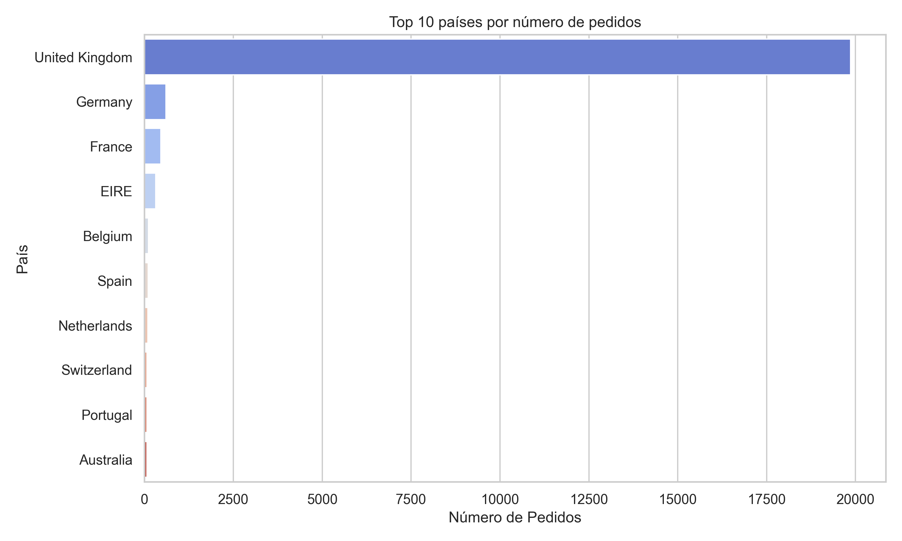
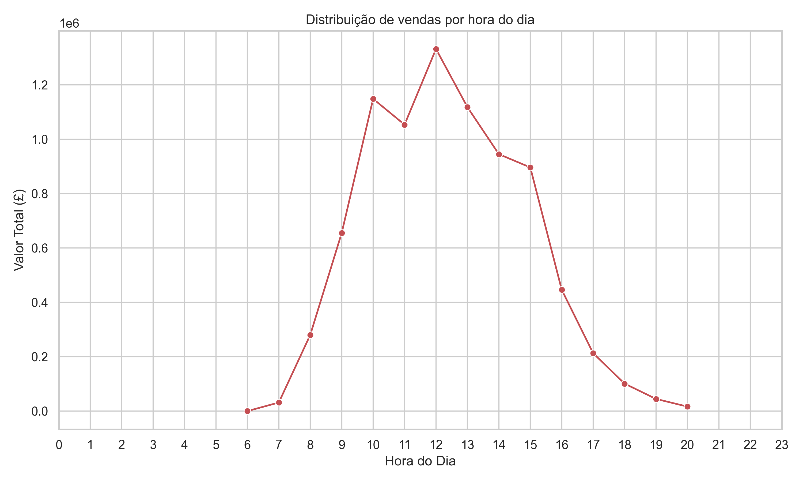
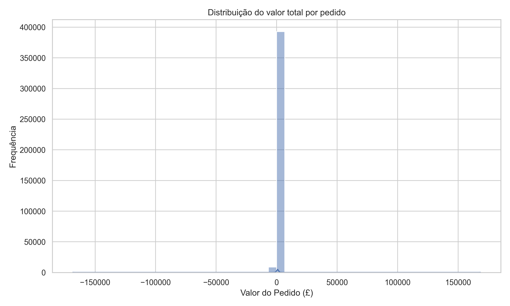

# 📊 Análise de Vendas de E-commerce

Este projeto realiza uma **análise exploratória de dados** de um e-commerce, respondendo perguntas de negócio como:
- Qual é o ticket médio por cliente?
- Quais são os produtos mais vendidos?
- Quais países geram mais receita?

O objetivo é aplicar técnicas básicas de **limpeza, exploração e visualização de dados** usando Python, Pandas, Matplotlib e Seaborn.

---

## 🗂 Dataset
O conjunto de dados utilizado foi obtido no [Kaggle - E-commerce Data](https://www.kaggle.com/datasets/carrie1/ecommerce-data).  
Contém informações sobre transações, produtos, quantidades, preços e clientes.

---

## 📌 Principais Resultados

### 🎯 Ticket médio
O ticket médio por cliente foi calculado a partir do valor total gasto dividido pelo número de compras.

---

### 🏆 Top 10 produtos mais vendidos


---

### 💰 Top 10 produtos mais lucrativos


---

### 🌍 Top 10 países por valor de vendas


---

### 📦 Top 10 países por número de pedidos


---

### 📈 Vendas mensais


---

### 🕒 Distribuição de vendas por hora do dia


---

### 💳 Distribuição do valor total por pedido



---

## 🚀 Tecnologias utilizadas
- Python 3
- Pandas
- Matplotlib
- Seaborn
- Jupyter Notebook

---

## 📂 Como rodar o projeto localmente

1. Clone o repositório:
```bash
git clone https://github.com/SEU-USUARIO/analise-vendas-ecommerce.git
cd analise-vendas-ecommerce
```

2. Crie um ambiente virtual e ative:
```bash
python -m venv venv
# Windows
venv\Scripts\activate
# Linux/Mac
source venv/bin/activate
```

3. Instale as dependências:
```bash
pip install -r requirements.txt
```

4. Abra o notebook:
```bash
jupyter notebook analise-exploratoria.ipynb
```