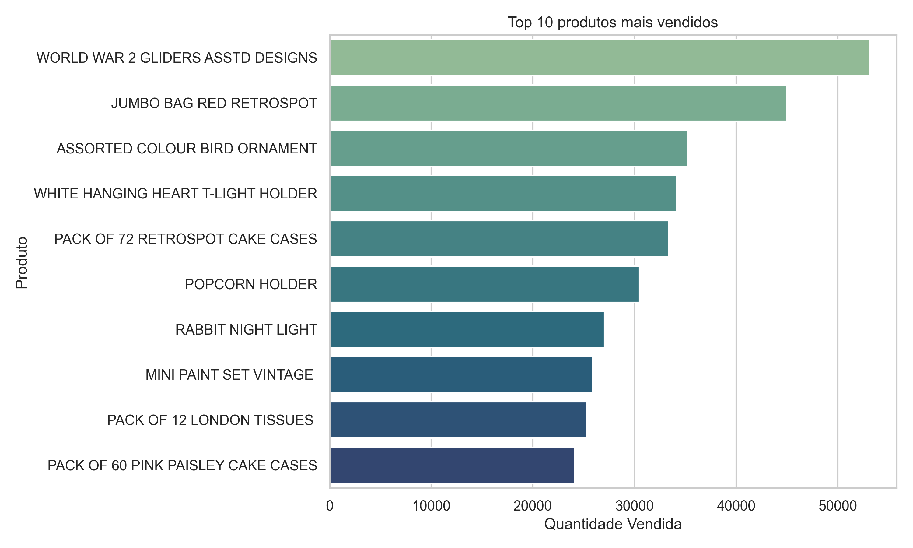
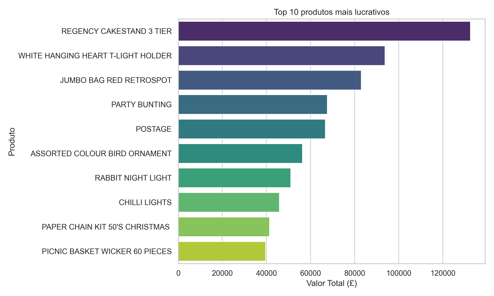
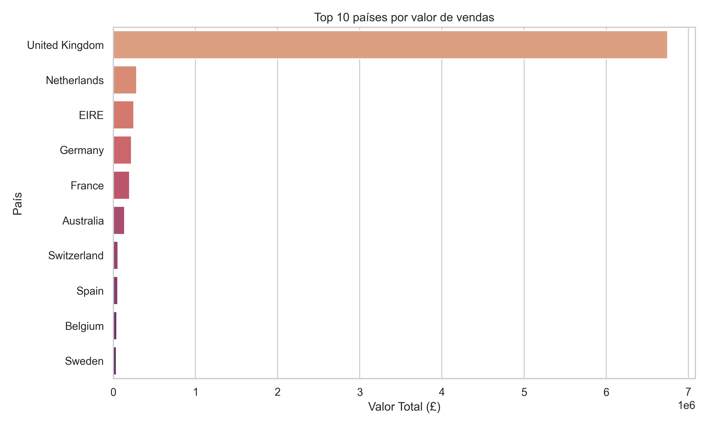
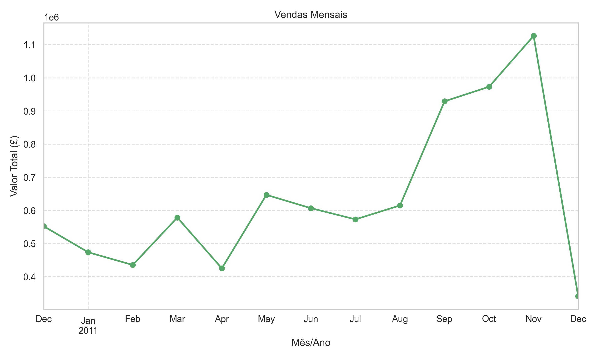

# 📊 Análise Exploratória de Vendas em E-commerce

## Objetivo

Este projeto tem como objetivo realizar uma **análise exploratória de dados (EDA)** de um e-commerce, identificando padrões de compra, produtos e países mais relevantes, além de fornecer insights para estratégias comerciais e operacionais.

---

## Dataset

- **Fonte:** [Kaggle - E-commerce Data](https://www.kaggle.com/datasets/carrie1/ecommerce-data)
- **Descrição:** Dados transacionais de um e-commerce do Reino Unido, contendo informações sobre pedidos, clientes, produtos, valores, datas e países.

---

## Como rodar o projeto

1. **Clone o repositório:**
    ```bash
    git clone https://github.com/SEU-USUARIO/analise-vendas-ecommerce.git
    cd analise-vendas-ecommerce
    ```

2. **Crie e ative um ambiente virtual:**
    ```bash
    python -m venv venv
    # Windows
    venv\Scripts\activate
    # Linux/Mac
    source venv/bin/activate
    ```

3. **Instale as dependências:**
    ```bash
    pip install -r requirements.txt
    ```

4. **Abra o notebook:**
    ```bash
    jupyter notebook analise-exploratoria.ipynb
    ```

---

## Stack utilizada

- Python 3
- Pandas
- Matplotlib
- Seaborn
- Jupyter Notebook

---

## Resumo dos principais achados

### 🎯 Ticket médio por cliente
O ticket médio indica quanto, em média, cada cliente gasta por compra, sendo um dos principais indicadores de performance do e-commerce.

---

### 🏆 Top 10 produtos mais vendidos
Produtos mais populares em quantidade, essenciais para gestão de estoque e campanhas de marketing.



---

### 💰 Top 10 produtos mais lucrativos
Produtos que mais geram receita, importantes para estratégias de rentabilidade.



---

### 🌍 Top 10 países por valor de vendas
Análise dos países que mais contribuem para o faturamento, útil para direcionamento de esforços comerciais.



---

### 📈 Vendas mensais
Evolução das vendas ao longo do tempo, permitindo identificar tendências e sazonalidades.



---

## Próximos passos

- Implementar análise de clusters de clientes (segmentação avançada)
- Explorar sazonalidade e tendências com séries temporais
- Desenvolver dashboards interativos (ex: Power BI, Streamlit)
- Avaliar impacto de devoluções/cancelamentos em diferentes produtos e países
- Propor recomendações de negócio baseadas nos insights encontrados

---

> Projeto desenvolvido para fins de estudo e demonstração de análise de dados em